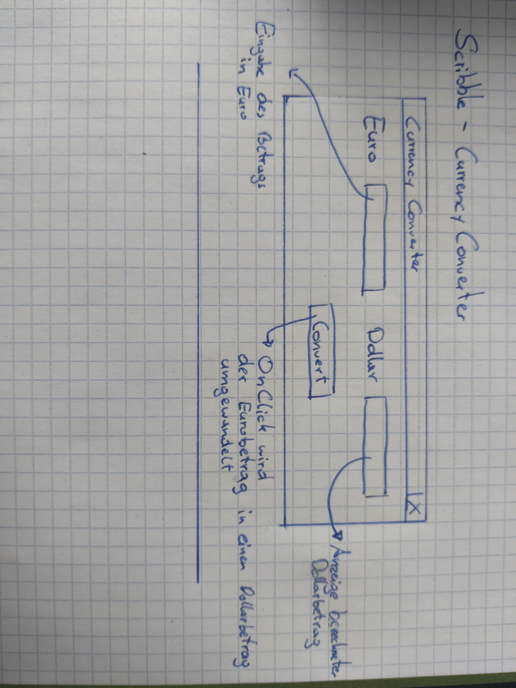

# Dokumentation - CurrencyConverter (26.09.2021)


### Idee

Ich wollte neben einer kleinen Konsolenanwendung auch eine Anwendung mit GUI schreiben. Meine Wahl fiel auf den CurrencyConverter. Die Idee ist simpel: Man gibt einen Eurobetrag ein und dieser wird in einen Dollarbetrag umgewandelt.


### Scribble



### Ziel

Ziel ist es mich mit weiteren Python-Frameworks vertraut zu machen und Grundlagen zu festigen.

- GUI mit tkinter
- Exception-Handling


### 	Umsetzung

Angefangen habe ich damit ein Fenster zu erstellen.

```python
# Ein Fenster erstellen
window = Tk()
# Window width und height
window.geometry("400x100")
# Einen Fenstertitel hinzufügen
window.title("Currency Converter by Alex")
```

Als nächstes habe ich alle meine Variablen erstellt und sie gleich auf meinem Grid platziert.

```python
# Variables Euro
euro_label = Label(window, text="Euro")
euro_label.grid(row=0, column=0, columnspan=1, pady=10, padx=15)
amount_euro = StringVar()
euro_entry = Entry(window, textvariable=amount_euro)
euro_entry.grid(row=0, column=1, pady=10, columnspan=1)

# Variable Dollar
dollar_label = Label(window, text="Dollar")
dollar_label.grid(row=0, column=3, pady=10, columnspan=1)
amount_dollar = StringVar()
dollar_entry = Entry(window, textvariable=amount_dollar)
dollar_entry.grid(row=0, column=4, pady=10, columnspan=1)
dollar_entry.config(state=DISABLED)

# Convert Button
convertBtn = Button(window, text="Convert", command=convertValue)
convertBtn.grid(row=2, column=3, pady=20, columnspan=1)
```

Das Attribut "command" ermöglicht es eine Funktion zu übergeben. Dadurch konnte ich meinem Button die Funktion "convertValue" mitgeben die aus meinem Eurobetrag einen Dollarbetrag macht.

In der Funktion habe ich einen "ValueError" abgefangen. (Sollte jemand meinen keine Zahl einzugeben)

```python
def convertValue():
    try:
        global amount_euro, amount_dollar
        euros = amount_euro.get()
        dollars = str(float(euros.replace(",", ".")) * 1.17)
        amount_dollar.set(dollars)
    except ValueError:
        print("Please enter a valid number!")
    except:
        print("Something unexpected happened")
```

Und zu guter Letzt, die eine Zeile die im Endeffekt den ganzen Code ausführt.:

```python
window.mainloop()
```

Und das war auch schon wieder die Dokumentation zu meinem zweiten Übungsbeispiel.

