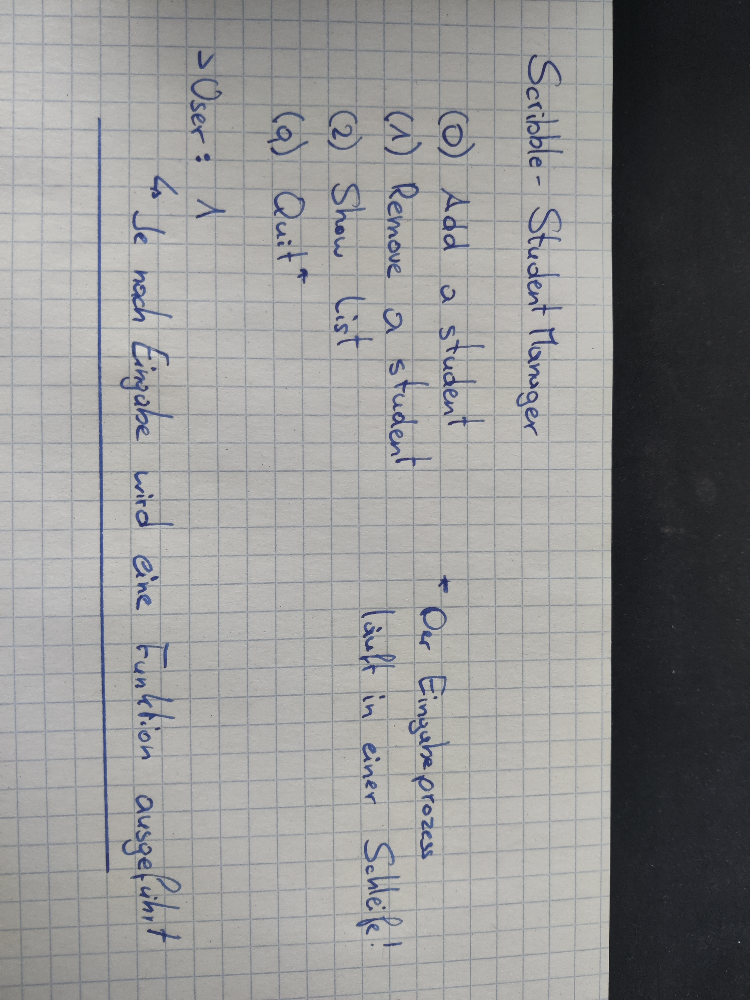

# Dokumentation - Student-Manager (19.09.2021)


### Idee

Die Idee ist es eine einfache Konsolenanwendung zu erstellen die es dem User ermöglicht eine Liste von Schülern zu bearbeiten. Zur Auswahl stehen

- einen Schüler hinzufügen (erfolgt über die Konsole)
- einen Schüler aus der Liste entfernen
- alle Schüler einer Liste anzeigen


### Scribble



### Ziel

Das Ziel dieser Anwendung ist es mich mit den Grundlagen in Python vertraut zu machen darunter besonders:

+ I/O
+ User-Interaction
+ Listen + deren Funktionen
+ Funktionen
+ if/else & switch Abfragen
+ Schleifen

### Umsetzung

Umgesetzt habe ich es wie folgt.:

Ich habe eine "Datenklasse" für meinen Schüler erstellt. (Ob das "best-practise" ist weiß ich nicht).

```python
class Student:
    def __init__(self, firstname, lastname, dateOfBirth, className):
        self.firstname = firstname
        self.lastname = lastname
        self.dateOfBirth = dateOfBirth
        self.className = className
```

Die komplette Funktionalität passiert in der Main.py. In einer While-True-Schleife wird immer wieder das Startmenü gezeigt. Man kann dort zwischen drei Funktionen (Einfügen, Entfernen, Anzeigen) auswählen oder per Eingabe der "Q" Taste das Programm beenden.

```python
while True:
    print("(0) Add a student")
    print("(1) Remove a student")
    print("(2) Show list")
    print("(q) Quit")
    userInput = input("Please choose an option: ")
    ownSwitch(userInput)
    if userInput.lower() == "q":
        break
```

Da Python keine Switch-Anweisung besitzt habe ich mir einen eigen kleine Switch zusammengebaut, dieser übernimmt auch gleich ein wenig an Exception-Handling.

```python
def ownSwitch(zahl):
    if zahl == "0":
        addStudent()
    elif zahl == "1":
        removeStudent()
    elif zahl == "2":
        showList()
    elif zahl == "q":
        return
    else:
        print("Wrong input! Try again")
```

Im Switch werden im Endeffekt nur meine geschriebenen Funktionen aufgerufen. Sehr trivial.

addStudent() fügt einen Student in meine StudentList ein. In der Funktion erfolgt eine Eingabeaufforderung für den User.

```python
def addStudent():
    firstname = input("Please enter students firstname: ")
    lastname = input("Please enter students lastname: ")
    dateOfBirth = input("Please enter students birthday: ")
    className = input("Please enter students classname: ")
    # Create Student
    tempStudent = Student(firstname, lastname, dateOfBirth, className)
    # Add student
    studentList.append(tempStudent)
```

removeStudent() löscht einen Student aus der Liste heraus. Der User gibt einen Namen ein, sollte der Name oder ein Teil des Namens in der Liste vorkommen, wird das dazugehörige Objekt gelöscht. Wird kein passendes Objekt gefunden wird eine Nachricht ausgegeben.

```python
def removeStudent():
    global studentList
    name = input("Please enter the name of the student you want to delete: ")
    # Find student
    for student in studentList:
        if name.lower() in student.firstname.lower():
            studentList.remove(student)
        else:
            print("Student not found")
```

showList() zeigt, wie der Name schon vermuten lässt, die gesamte aktuelle Liste an.

```python
def showList():
    global studentList
    for student in studentList:
        print(student.__dict__)
```


Und das war auch schon im Großen und Ganzen meine Anwendung. ;)
